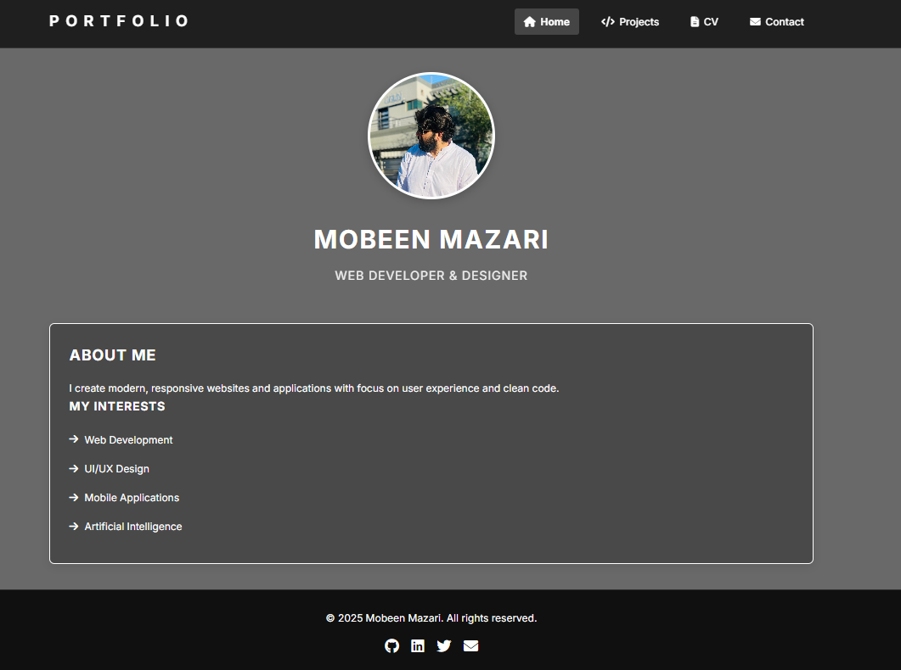

# 🌐 Mobeen Mazari's Portfolio Website

Welcome to my personal portfolio website! This site showcases my projects, curriculum vitae, and ways to get in touch with me. Built using **HTML**, **CSS**, and **Bootstrap**, it's fully responsive and easy to navigate.

---

## 📁 Project Structure

```
portfolio-website/
│
├── index.html         # Homepage with hero section and interests
├── project.html      # Projects page showcasing my work
├── cv.html           # Curriculum Vitae page
├── contact.html      # Contact form and social links
│
├── styles/
│   ├── index.css
│   ├── project.css
│   ├── cv.css
│   └── contact.css
│
├── scripts/
│   ├── index.js
│   ├── project.js
│   ├── cv.js
│   └── contact.js  
│
└── content/
    └── profile_picture.jpeg
    ├── cv.pdf       
```

---

## 🚀 Features

- 🧭 Fixed responsive navbar with icons
- 🖼️ Hero section with introduction
- 💼 Project cards for showcasing work
- 📄 CV section (static HTML or PDF linked)
- 📬 Contact section with social media icons
- 🌓 Dark-themed modern design

---

## 📷 Preview



---

## 🛠️ Technologies Used

- HTML5
- CSS3 (with custom variables)
- Bootstrap (optional)
- Font Awesome Icons

---

## 📂 How to Use

1. Clone the repository:
   ```bash
   git clone https://github.com/yourusername/portfolio-website.git
   cd portfolio-website
   ```

2. Open `home.html` in a browser or deploy the project using GitHub Pages, Netlify, or Vercel.

---

## 🐛 Known Issues

- Responsive menu toggle may need JS for interactivity.
- Semi-transparent navbar edges may appear uneven if not adjusted (see `navbar` width and padding fixes).

---

## ✨ Future Improvements

- Add animation for page transitions
- Include a blog or testimonial section
- Improve accessibility and SEO metadata

---

## 📬 Contact

Feel free to reach out via:

- [GitHub](https://github.com/yourusername)
- [LinkedIn](https://linkedin.com/in/yourusername)
- [Email](mailto:your.email@example.com)

---

## 📝 License

This project is open-source and free to use under the [MIT License](LICENSE).
